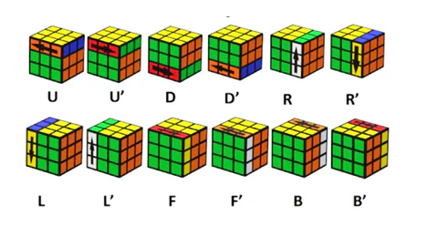

# Rubik's Cube

This is Rubik's Cube made mainly with 3-dimensional CSS transforms and a bit of JavaScript to execute them. No WebGL or libraries such as Three.js are used.

https://rubikcubecss.netlify.app

  
Open the menu with the `i` key to see all the keys for rotating the cube and its layers.

When many rotations are entered quickly in a row, a queue executes them one by one. There are also options to undo moves, scramble the cube, reset the cube, zoom, or make the cube transparent. When the cube is solved, an animation is started.

# Projet WE

(Il est NECESSAIRE d'utiliser l'extension liveserver , autrement cela ne fonctionne pas).

J'ai choisi de faire un projet concernant le rubik's cube car je suis un passioné qui en fait en compétition et je voulais donc avoir un projet lié à ceci afin d'avoir un peu plus de motivation à faire le projet. Il n'y en avait pas beaucoup de disponible donc j'ai du prendre ce projet. C'est un projet javascript qui permets de résoudre son rubik's cube.

Il fallait donc que nous rajoutions une fonctionnalité au projet. Je suis donc parti dans l'idée de rajouté l'historique des mouvements effectués pour résoudre le rubik's cube. Pour résoudre un rubiks cube, nous utilison des rotations et utilisons le système de rotation international qui est celui-ci : 

(Il n'y a pas tout les mouvements notamment les mouvements M, S et E sur cette image mais c'est la meilleure que j'ai pu trouvé,
l'image vient du site suivant : https://www.wfoqfashion.shop/?path=page/ggitem&ggpid=2668858)

Comme vous pouvez le constater, il y a le mouvement par exemple F et le mouvement inverse qui est F'. Cependant le créateur du projet à mis f pour F et F pour F' , nous avons donc créer la même logique.
On a donc créer le fichier moveHistory qui va stocker dans un tableau les touches presser par l'utilisateur afin de pouvoir les affichers. Il existe cependant des cas où il ne faut pas les afficher : quand on annule sa dernière rotation ( chose impossible en vrai, cela rajouterai juste la rotation inverse mais pas ici donc nous avons garder la logique du projet original) et alors on enlève le dernier élément du tableau. Ou alors lorsque on mélange ou résoud le cube, dans ces 2 cas, nous remettons l'historiques des mouvements à 0. 
Enfin afin de pouvoir l'afficher ou non, nous avons créer un toogle qui permet d'activer ou non la fonctionnalité. Il ne nous reste plus qu'à ajouter la fonctionalité au keyController qui est le fichier où il gère tout les appels sur une touche et d'indiqué  la fonctionnalité sur la page HTML.

Jason Vannier et Amaël Kesteman